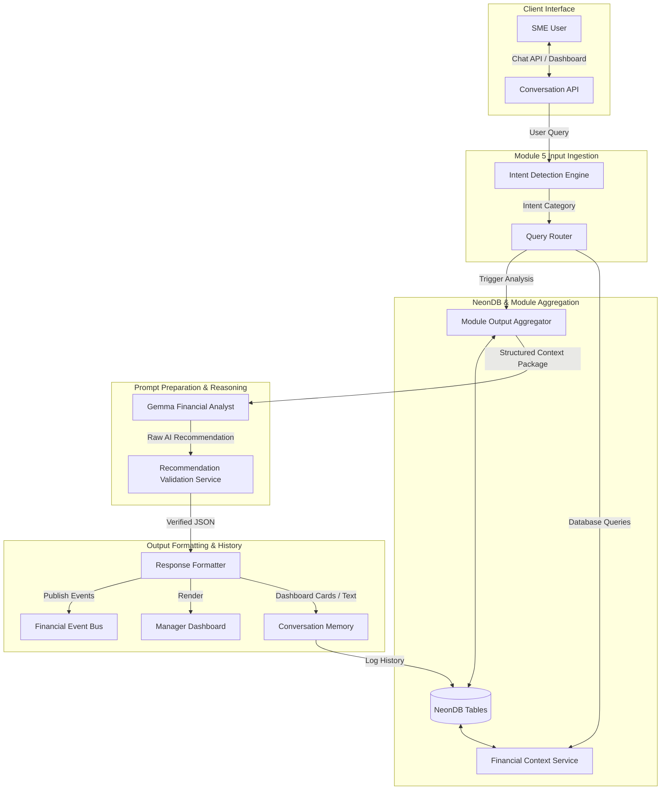

# SYSTEM ARCHITECTURE DESIGN SPECIFICATION
## MODULE 5: AI FINANCIAL DECISION & ADVISORY ENGINE

---

## 1. MODULE OVERVIEW

### 1.1 Scope & Purpose
Module 5 (AI Financial Decision & Advisory Engine) acts as the executive intelligence layer of the SME Financial Copilot. It aggregates structured outputs from all previous modules (Module 1 cash flow forecasts, Module 2 liquidity risk levels, Module 3 collection recommendations, Module 4 optimized payment queues) and processes them into conversational responses, scenario summaries, and dashboard notifications.

### 1.2 Boundary Constraints
* **No AI Calculations**: Gemma is prohibited from performing financial forecasting, optimization, or risk scoring. Gemma only interprets and explains calculations performed by the deterministic modules.
* **Deterministic Intent & Routing**: Query routing and intent classification are handled by rule-based engines, ensuring predictable database access.
* **Database Isolation**: Conversational logs and histories are stored with strict company tenant partition keys.

---

## 2. ARCHITECTURE DIAGRAM

The pipeline below details the data flow through Module 5:



---

## 3. DATA FLOW

1. **Query Ingestion**: The user submits a query (e.g. "Can I buy a new CNC machine next week?") via the **Conversation API**.
2. **Intent Parsing & Routing**:
   * The **Intent Detection Engine** classifies the request intent.
   * The **Query Router** directs the request to the correct module context (e.g., Module 1 for forecasts, Module 2 for liquidity).
3. **Context Aggregation**: The **Module Output Aggregator** combines current account balances, historical vendor files, and cash forecasts into a unified structured context package.
4. **AI Reasoning**: Gemma parses this context package to draft responses, scenario comparisons, and risk explanations.
5. **Validation**: The **Recommendation Validation Service** ensures Gemma's output conforms to JSON schemas and matches the reference calculations.
6. **Formatting & Output**: The **Response Formatter** structures the response into dashboard cards, charts, or summaries, logging the session in `Conversation Memory` and emitting events to the Event Bus.

---

## 4. COMPONENT RESPONSIBILITIES

| Component | Responsibility | Constraints |
| :--- | :--- | :--- |
| **Conversation API** | Manages web-sockets and HTTP endpoints for chat and dashboards. | None. |
| **Intent Detection Engine** | Classifies query intent (e.g. `Forecast Question`, `Scenario Analysis`). | **No AI**. Strict rule-based classifications. |
| **Query Router** | Directs requests to the correct module context. | **No AI**. Rule-based routing mapping. |
| **Module Output Aggregator**| Aggregates cash flow, AP/AR, and risk metrics into a structured prompt package. | Prepares data packages before LLM ingestion. |
| **Gemma Financial Analyst** | Explains risk metrics, drafts scenario analyses, and writes summaries. | **AI**. Prohibited from calculating values or overriding rules. |
| **Validation Service** | Checks Gemma's outputs for JSON schema compliance. | Must implement retry and fallback configurations. |
| **Response Formatter** | Formats recommendations into dashboard cards, alerts, or summaries. | Visual layout formatting only. |
| **Conversation Memory** | Manages session histories to preserve conversation context. | Strict company tenant partitioning. |

---

## 5. INTENT DETECTION ENGINE

The Intent Detection Engine uses a rule-based classifier to map queries to defined intents:
* **Forecast Question**: Queries about future cash trends (e.g., "What does my balance look like in 30 days?").
* **Liquidity Question**: Queries about cash buffers and solvency (e.g., "Do I have enough cash for raw materials?").
* **Invoice Question**: Queries about collection actions (e.g., "Who has not paid their invoice?").
* **Payment Question**: Queries about optimized payables (e.g., "Which supplier bills should I pay today?").
* **Scenario Analysis**: "What-if" queries (e.g., "What if my steel material costs increase by 15%?").
* **Business Health**: Requests for high-level summaries (e.g., "Give me a weekly financial summary").

---

## 6. QUERY ROUTER

The Query Router maps the classified intent to the database schemas of the corresponding module:

```
+------------------+         +------------------+         +------------------+
| Classified Intent| ------> |   Query Router   | ------> | Module DB Target |
+------------------+         +------------------+         +------------------+
  Forecast Q                   Maps Intent                  Module 1 Tables
  Liquidity Q                  Checks Session               Module 2 Tables
  Invoice Q                    Appends company_id           Module 3 Tables
  Payment Q                    Enforces tenant filters      Module 4 Tables
  Scenario Analysis            Triggers simulation          Module 1 + 2 Engines
```

This routing structure ensures that the LLM is only fed relevant context, minimizing token consumption and preventing cross-tenant data leaks.

---

## 7. MODULE OUTPUT AGGREGATOR

The Module Output Aggregator combines outputs from previous modules into a structured XML/JSON prompt package:

```json
{
  "company_id": "apex-cnc-uuid",
  "cash_position": {
    "current_balance": 54200.00,
    "currency": "USD"
  },
  "module_1_forecast": {
    "snapshot_reference": "run-9901",
    "projected_7_day_balance": 52100.00,
    "projected_30_day_balance": 48200.00,
    "cash_buffer_30_days": 15000.00
  },
  "module_2_liquidity": {
    "risk_level": "MEDIUM",
    "liquidity_score": 72,
    "detected_risks": [
      { "type": "VENDOR_PAYMENT_RISK", "date": "2026-07-28", "amount": 12500.00 }
    ]
  },
  "module_3_invoice_intelligence": {
    "critical_receivables_count": 2,
    "total_receivables_due": 18200.00
  },
  "module_4_payment_recommendations": {
    "scheduled_autopay_count": 5,
    "total_autopay_amount": 8500.00,
    "approval_required_count": 2,
    "total_approval_amount": 25000.00
  }
}
```

* **Why Aggregation Occurs Before Gemma**: Feeding pre-aggregated financial data to Gemma prevents the LLM from attempting calculations or hallucinating values.

---

## 8. GEMMA FINANCIAL ANALYST

Gemma operates as the advisory generation layer. It parses the aggregated context to generate:
* **Executive Summaries**: High-level overviews of business health.
* **Financial Explanations**: Clear descriptions of why cash balances or liquidity scores have changed.
* **Decision Recommendations**: Advice on cash management options (e.g. buying a CNC machine).
* **Scenario Comparisons**: Contrast reports between base cases and simulated what-if files.

### 8.1 LLM Safety Boundaries
Gemma cannot:
* Recalculate invoice totals or cash forecasts.
* Modify validation checks or override business rules.
* Directly dispatch payments or create dashboard tasks.

---

## 9. SCENARIO ANALYSIS WORKFLOW

Scenario analysis allows users to run "what-if" simulations:

```
[ User Query ]
"What if customer Apex delays their $15k payment by 30 days?"
     |
     v
[ Scenario Analyzer ]
Calculates delayed collection offset: Due Date + 30 Days
     |
     v
[ Module 1 Forecast Engine (Simulation Mode) ]
Re-calculates 30-day forecast with delayed cash inflow
     |
     v
[ Module 2 Risk Engine (Simulation Mode) ]
Re-calculates liquidity score and flags new risk events
     |
     v
[ Context Aggregator ]
Packages simulation results: Base Case vs Simulated Case
     |
     v
[ Gemma Financial Analyst ]
Drafts executive summary comparing the outcomes
     |
     v
[ User Dashboard ]
Displays comparative forecast chart and Gemma's explanation
```

This workflow ensures that all scenario math is computed deterministically before Gemma drafts the final business impact summary.

---

## 10. RECOMMENDATION VALIDATION SERVICE

The validation layer inspects Gemma's output:
1. **JSON Parser Validation**: Asserts that the response is valid JSON.
2. **Schema Matching**: Confirms presence of all required fields.
3. **Format Checks**: Validates that target dates match `YYYY-MM-DD`.
4. **Retry Mechanism**: If validation fails, the service requests a new generation from Gemma (up to 3 retries).
5. **Fallback Action**: If retries are exhausted, the system defaults to a deterministic fallback action: `recommended_action = "MANUAL_REVIEW"`, `approval_required = true`, logging a validation error.

---

## 11. RESPONSE FORMATTER

The Response Formatter structures approved recommendations into various visual layouts:
* **Dashboard Cards**: High-level alert banners with quick action buttons.
* **Bullet Recommendations**: Action lists for accounts payable/receivable staff.
* **Scenario Comparisons**: Two-column layouts contrasting base case charts with simulated run outcomes.
* **Risk Alerts**: High-priority alert popups for projected cash buffer breaches.

---

## 12. CONVERSATION MEMORY

Manages session histories to preserve conversation context:

```sql
CREATE TABLE conversation_sessions (
    id UUID PRIMARY KEY DEFAULT uuid_generate_v4(),
    company_id UUID NOT NULL REFERENCES companies(id) ON DELETE CASCADE,
    session_token VARCHAR(255) UNIQUE NOT NULL,
    created_at TIMESTAMP WITH TIME ZONE DEFAULT CURRENT_TIMESTAMP,
    updated_at TIMESTAMP WITH TIME ZONE DEFAULT CURRENT_TIMESTAMP
);

CREATE TABLE conversation_messages (
    id UUID PRIMARY KEY DEFAULT uuid_generate_v4(),
    session_id UUID NOT NULL REFERENCES conversation_sessions(id) ON DELETE CASCADE,
    sender VARCHAR(10) NOT NULL CHECK (sender IN ('USER', 'SYSTEM', 'CO_PILOT')),
    message_content TEXT NOT NULL,
    created_at TIMESTAMP WITH TIME ZONE DEFAULT CURRENT_TIMESTAMP
);
```

* **Usage**: Retained to allow users to ask follow-up questions (e.g. "Why?") without re-explaining context.

---

## 13. AI DECISION HISTORY

Stores the context and results of every advisory interaction:

```sql
CREATE TABLE ai_decision_history (
    id UUID PRIMARY KEY DEFAULT uuid_generate_v4(),
    company_id UUID NOT NULL REFERENCES companies(id) ON DELETE CASCADE,
    run_timestamp TIMESTAMP WITH TIME ZONE DEFAULT CURRENT_TIMESTAMP,
    user_query TEXT NOT NULL,
    aggregated_context_hash VARCHAR(64) NOT NULL,
    gemma_response JSONB NOT NULL,
    module_references JSONB NOT NULL, -- References to forecast_snapshot_id, etc.
    user_feedback_rating INT CHECK (user_feedback_rating BETWEEN 1 AND 5),
    user_override_flag BOOLEAN DEFAULT FALSE
);
```

* **Usage**: Retained to audit advisory decisions and monitor user satisfaction.

---

## 14. FINANCIAL EVENT FLOW

Module 5 publishes events to the Event Bus:
* `Manager Review Requested`: Triggered when recommendations require manual override.
* `Scenario Generated`: Logged to verify simulation run history.
* `Recommendation Accepted / Rejected`: Captures user feedback to evaluate recommendation relevance.
* `Business Alert Created`: Triggers SMS or email warnings for high-risk cash forecasts.

---

## 15. MODULE OUTPUTS

Every execution run of Module 5 produces:
1. Executive summaries of SME financial health.
2. Actions and payment advice.
3. Natural language explanations of risk vectors.
4. Comparative reports for "what-if" scenarios.
5. Entries in the `conversation_messages` and `ai_decision_history` tables.

---

## 16. DESIGN DECISIONS & RATIONALE

* **Deterministic Validation**: Business rules override LLM recommendations. For example, if Gemma recommends sending a reminder, but the company policy restricts contact to once per week, the Business Rule Engine overrides the recommendation to `WAIT`.
* **Structured Prompts**: By enforcing a JSON output format, Gemma can be integrated into automated software workflows.
* **Tenant Isolation**: Database rows are filtered by `company_id` to prevent cross-tenant data leaks.

---

## 17. SYSTEM FLOW DIAGRAM

```
+---------------------------------------------------------------------------------------------------+
|                                      CONVERSATION API GATEWAY                                     |
+---------------------------------------------------------------------------------------------------+
|                                                                                                   |
|    User Query Ingestion                                                                           |
|          |                                                                                        |
|          v                                                                                        |
|  (Intent Detection Engine) ====> Classifies query intent using rule-based keywords               |
|          |                                                                                        |
|          v [Classified Intent]                                                                    |
|  (Query Router)            ====> Appends company tenant UUID and routes to target schemas        |
|          |                                                                                        |
|          v [Routed Queries]                                                                       |
|  (Module Output Aggregator)====> Selects forecast, risk, collections, and bill details            |
|          |                                                                                        |
|          v [Aggregated Context JSON]                                                              |
|  (Gemma Financial Analyst) ====> Generates explanations, advice, and email draft copy            |
|          |                                                                                        |
|          v [Advisory JSON Payload]                                                                |
|  (Validation Service)      ====> Asserts schema compliance; executes fallback retry logic        |
|          |                                                                                        |
|          v [Validated JSON]                                                                       |
|  (Response Formatter)      ====> Builds card layouts, lists, alert widgets, and timeline maps      |
|          |                                                                                        |
|          +-----------------------------+-----------------------------+                            |
|          |                             |                             |                            |
|          v                             v                             v                            |
|  [ ai_decision_history ]     [ conversation_messages ]     [ Event Bus Publication ]              |
|  - Log question & answers     - Append session memory       - Emit "Alert Created" event          |
|  - Save prompt hashes         - Log client feedback         - Downstream dashboards update        |
|                                                                                                   |
+---------------------------------------------------------------------------------------------------+
```
