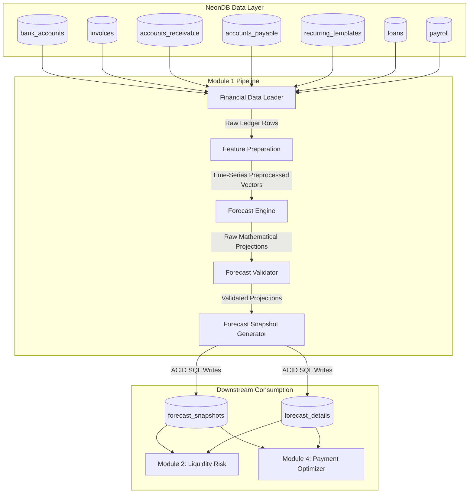

# SYSTEM ARCHITECTURE DESIGN SPECIFICATION
## MODULE 1: DETECTIVE & DETERMINISTIC CASH FLOW FORECASTING ENGINE

---

## 1. MODULE OVERVIEW

### 1.1 Mission & Bounds
Module 1 (Cash Flow Forecasting Engine) provides the predictive financial backbone of the Manufacturing SME Financial Copilot. Its primary objective is to project the short-to-medium-term cash balances of the enterprise across three distinct horizons: **7 Days**, **30 Days**, and **90 Days**. 

To maintain strict regulatory audit compliance and explainability, this module operates under the following architectural constraints:
* **Deterministic Execution**: Projections must be calculated using explicit mathematical rules (Rolling averages, credit aging offsets, template mapping). Random processes, statistical distribution sampling, or machine learning model drift are prohibited.
* **Gemma/LLM Exclusion**: Large Language Models are not permitted in the data processing or forecast calculation loops. Projections must be 100% repeatable given the same database states.
* **Database Interfaced Boundary**: Module 1 reads exclusively from relational tables in NeonDB and writes its completed projections back to NeonDB in the form of structured **Forecast Snapshots**. Downstream modules consume only these structured snapshots from NeonDB.

---

## 2. ARCHITECTURE DIAGRAM

The workflow below outlines the data ingestion, transformation, calculation, validation, and storage pipeline of the forecasting engine:



---

## 3. DATA FLOW

1. **Ingest Query (Data Loading)**: The pipeline triggers on a schedule (e.g. daily at 00:00 UTC) or upon manual request. The **Financial Data Loader** queries NeonDB for active balances, invoice due dates, recurring templates, salaries, and EMIs.
2. **Feature Transformation**: Raw data vectors are transformed into daily time-series cash streams (credits/debits). Adjustments are made to project collections based on customer credit histories.
3. **Horizon Projection**: The **Forecast Engine** calculates the cash inflows, outflows, and projected balances for the three horizons using Moving Averages and Trend Projections.
4. **Validation Filter**: Projections are inspected by the **Forecast Validator** to prevent negative balance errors, identify data completeness gaps, and flag mathematical inconsistencies.
5. **Snapshot Writing**: Validated forecasts are converted into transactional queries by the **Forecast Snapshot Generator** and committed to `forecast_snapshots` and `forecast_details` in NeonDB.

---

## 4. COMPONENT RESPONSIBILITIES

### 4.1 Financial Data Loader
* **Primary Role**: Extraction of structured financial assets, obligations, and history.
* **Inputs**: NeonDB core tables.
* **Outputs**: Raw database schema models in memory.
* **Details**:
  * Queries `bank_accounts` to establish the baseline liquidity position.
  * Fetches pending balances from `accounts_receivable` and `accounts_payable`.
  * Loads active templates from `recurring_templates` (rent, software, service AMCs).
  * Queries loan liabilities from `loans` and factory salary overheads from `payroll`.

### 4.2 Feature Preparation
* **Primary Role**: Preprocessing data inputs into daily scheduled cash vectors.
* **Inputs**: Raw database models.
* **Outputs**: Time-series arrays (Daily Projected Inflows, Daily Projected Outflows).
* **Details**:
  * Adjusts invoice settlement dates by applying customer-specific payment lag coefficients.
  * Extrapolates recurring templates into calendar entries.
  * Computes historical rolling averages of variable expenses (e.g. scrap steel purchases) to establish baseline cash outflows.

### 4.3 Forecast Engine
* **Primary Role**: Deterministic mathematical projection calculation.
* **Inputs**: Time-series cash vectors.
* **Outputs**: Raw forecast structures (inflow, outflow, balance, confidence).
* **Details**:
  * Applies rolling average filters to smooth out transaction patterns.
  * Applies trend projections to variable costs based on historical growth.
  * Integrates cash vectors to calculate projected balances for 7, 30, and 90 days.

### 4.4 Forecast Validator
* **Primary Role**: Quality gate preventing corrupted projections from writing to the database.
* **Inputs**: Raw forecast structures.
* **Outputs**: Validated forecast models or error events.
* **Details**:
  * Asserts that projected cash balances do not fall below the company's designated safety threshold without raising warning flags.
  * Aborts execution if critical input tables (e.g. bank account balances) are empty or outdated.
  * Evaluates outlier patterns against historical cash standard deviations.

### 4.5 Forecast Snapshot Generator
* **Primary Role**: Transactional database storage serialization.
* **Inputs**: Validated forecast models.
* **Outputs**: PostgreSQL transaction commands.
* **Details**:
  * Transforms in-memory forecast matrices into database rows.
  * Records forecast metadata (execution timestamps, input data hashes) to enable future auditability.
  * Commits rows to `forecast_snapshots` and `forecast_details` inside a unified SQL transaction.

---

## 5. FORECAST PIPELINE DESIGN

### 5.1 Feature Preparation & Preprocessing Formulas
To calculate accurate cash schedules, raw database records are preprocessed using deterministic business rules:

#### 1. Accounts Receivable Collection Date Offset
Rather than assuming customers pay exactly on the invoice due date $D_i$, the system calculates an expected payment date $E_{c}$ using a customer-specific payment delay factor $P_c$:
$$P_c = \frac{1}{N} \sum_{j=1}^{N} (\text{Actual Settlement Date}_j - \text{Invoice Due Date}_j)$$
$$E_c = D_i + P_c$$
If a customer historically pays 12 days late on average ($P_c = 12$), an invoice due on July 20 is scheduled as cash inflow on August 1.

#### 2. Accounts Payable Liabilities Scheduling
Supplier bills in `accounts_payable` are mapped directly to their due dates, unless there is a cash discount deadline that Module 4 optimizes.

#### 3. Recurring Commitments Extrapolation
Templates from `recurring_templates` are expanded into daily cash schedules. An expense template with a monthly frequency of \$5,000 starting on July 1 generates payment events on July 1, August 1, and September 1.

#### 4. Historical Variable Expense Smoothing
For non-fixed factory expenditures (e.g., replacement of welding wire, CNC coolant), the system computes the 30-day rolling average of historical debit transactions:
$$\text{Base Outflow}_{\text{daily}} = \frac{1}{30} \sum_{k=1}^{30} \text{Variable Debits}_{[k]}$$

---

### 5.2 Deterministic Forecasting Approach
For the SME MVP, deterministic forecasting models (Moving Average and Trend Projection) are preferred over Machine Learning models:

1. **Auditability & Explainability**: A CNC shop owner must know *exactly* why the system projects a cash deficit (e.g., "The \$15,000 laser cutting invoice was delayed, and the CNC lathe EMI is due on July 28"). ML models cannot provide this audit trail.
2. **Data Scarcity**: Small manufacturing businesses do not have the transaction volume required to train neural networks. Statistical models operate reliably on minimal transaction history.
3. **Compute Efficiency**: Runs in milliseconds within serverless database environments like NeonDB.

---

### 5.3 Forecast Horizons
Projections are calculated over three horizons with specific fields:

| Horizon | Primary Focus | Critical Inputs Included |
| :--- | :--- | :--- |
| **7 Days** | Operational cash needs, payroll coverage, machine shop consumables. | Bank balances, accounts receivable/payable due this week, recurring expenses. |
| **30 Days** | Monthly loan EMIs, factory rent, payroll cycles, main customer billing. | All 7-day inputs + next month's invoices, recurring templates. |
| **90 Days** | Capital expenditures (Capex), raw material stock purchases, quarterly tax cycles. | All 30-day inputs + seasonal patterns + amortized loan structures. |

Each forecast horizon outputs the following structured fields:
* **Expected Cash Inflow**: Sum of projected collections and recurring income.
* **Expected Cash Outflow**: Sum of open bills, payroll, EMIs, and recurring expenses.
* **Projected Cash Balance**: 
  $$\text{Balance}_{t} = \text{Current Bank Balance} + \sum \text{Inflow}_{[t]} - \sum \text{Outflow}_{[t]}$$
* **Cash Buffer**: The minimum projected balance during that horizon.
* **Forecast Confidence**: Calculated deterministically based on data age and customer payment reliability variance.
* **Forecast Timestamp**: Exact UTC timestamp when the engine finished execution.

---

### 5.4 Forecast Validation rules
The validation layer intercepts projections before database commits:
* **Negative Cash Check**: If $\text{Projected Cash Balance}_t < 0$, it flags a liquidity warning but does not fail validation. If the balance exceeds the bank's allowed overdraft limit, validation fails.
* **Completeness Check**: Checks if bank account balances have been updated within the last 48 hours. If statement inputs are older, validation fails.
* **Outlier Detection**: Compares projected inflows against the 90-day standard deviation. Projections exceeding $\pm 3\sigma$ are flagged for review.
* **Failure Resolution**: Failed validations halt the pipeline, write an error report to `system_audit_trail`, and do not overwrite the current operational forecast.

---

## 6. FORECAST SNAPSHOTS DESIGN

Projections are written back to the `forecast_snapshots` schema in NeonDB:

```sql
-- 1. FORECAST SNAPSHOTS (Header record for a forecast run)
CREATE TABLE forecast_snapshots (
    id UUID PRIMARY KEY DEFAULT uuid_generate_v4(),
    company_id UUID NOT NULL REFERENCES companies(id) ON DELETE CASCADE,
    run_timestamp TIMESTAMP WITH TIME ZONE DEFAULT CURRENT_TIMESTAMP,
    data_hash VARCHAR(64) NOT NULL, -- Hash of input transactions used for auditability
    current_cash_balance DECIMAL(15, 2) NOT NULL,
    created_at TIMESTAMP WITH TIME ZONE DEFAULT CURRENT_TIMESTAMP
);

-- 2. FORECAST DETAILS (Individual horizon outputs)
CREATE TABLE forecast_details (
    id UUID PRIMARY KEY DEFAULT uuid_generate_v4(),
    snapshot_id UUID NOT NULL REFERENCES forecast_snapshots(id) ON DELETE CASCADE,
    horizon_days INT NOT NULL, -- 7, 30, or 90
    expected_inflow DECIMAL(15, 2) NOT NULL,
    expected_outflow DECIMAL(15, 2) NOT NULL,
    projected_balance DECIMAL(15, 2) NOT NULL,
    cash_buffer DECIMAL(15, 2) NOT NULL,
    confidence_score DECIMAL(3, 2) NOT NULL,
    horizon_start_date DATE NOT NULL,
    horizon_end_date DATE NOT NULL,
    UNIQUE(snapshot_id, horizon_days)
);
```

### 6.1 Rationale for Snapshot Retention
* **Backtesting & Accuracy Analysis**: By retaining historical snapshots, the system can compare projected balances against actual bank statements for the same date. This allows the calculation of Mean Absolute Percentage Error (MAPE) to tune the forecasting model.
* **Audit Trail Compliance**: Financial audits require tracking when projections were generated and what inputs were visible to the system at that time.

### 6.2 Downstream Consumption
* **Module 2 (Liquidity Risk Engine)**:
  * Reads the projected balance and cash buffer from the latest 30-day and 90-day snapshots.
  * If the projected cash balance drops below the company's designated safety threshold, Module 2 flags a liquidity threat.
* **Module 4 (Payment Schedule Optimizer)**:
  * Reads the 7-day and 30-day snapshots to identify days with surplus cash.
  * Schedules outstanding payables on days with higher cash buffers to avoid liquidity risk.

---

## 7. MODULE DEPENDENCIES

* **Module 0 (Ingest Engine)**: Populates the underlying transactions, bank statements, and invoices. Without Module 0, the forecasting database is empty.
* **NeonDB**: Serves as the database interface. Module 1 communicates with no other system component, decoupling the pipeline.
* **Modules 2 & 4 (Risk & Payables)**: Read the completed `forecast_snapshots` to identify cash shortfalls and optimize invoice payment cycles.

---

## 8. DESIGN DECISIONS & RATIONALE

* **Data Access Object (DAO) Separation**: The forecasting engine does not query database tables directly. It consumes pre-mapped data models, decoupling the forecasting logic from database schema updates.
* **Relational Storage over JSON Document Streams**: Projections are written to dedicated columns instead of raw JSON streams. This allows downstream modules to run queries and metrics directly on the database.
* **Payment Reliability Variance**: Invoices from customers with high payment date variance are assigned lower confidence weights, reflecting the risk of cash flow timing mismatches.

---

## 9. COMPLETE SYSTEM PIPELINE DIAGRAM

```
+---------------------------------------------------------------------------------------------------+
|                                      NEON OPERATIONAL DATABASE                                    |
+---------------------------------------------------------------------------------------------------+
|                                                                                                   |
|    +-----------------+        +-----------------+        +-----------------+                      |
|    |  bank_accounts  |        |    invoices     |        | accounts_pay/rec|                      |
|    +--------+--------+        +--------+--------+        +--------+--------+                      |
|             |                          |                          |                               |
+-------------+--------------------------+--------------------------+-------------------------------+
              |                          |                          |
              | (Select Raw Data Vectors)|                          |
              v                          v                          v
+---------------------------------------------------------------------------------------------------+
|                               MODULE 1 - CASH FLOW FORECAST PIPELINE                              |
+---------------------------------------------------------------------------------------------------+
|                                                                                                   |
|   (Financial Data Loader)  =========> Loads bank balances, open invoices, and recurring schedules |
|              |                                                                                    |
|              v [Raw Feature Data]                                                                 |
|   (Feature Preparation)    =========> Adjusts due dates with customer payment delay offsets       |
|              |                                                                                    |
|              v [Time-Series Arrays]                                                               |
|   (Forecast Engine)        =========> Computes 7-day, 30-day, and 90-day cash projections         |
|              |                                                                                    |
|              v [Raw Projections]                                                                  |
|   (Forecast Validator)     =========> Validates math consistency and detects negative balance issues|
|              |                                                                                    |
|              v [Validated Metrics]                                                                |
|   (Snapshot Generator)     =========> Serializes results into relational tables                    |
|              |                                                                                    |
+--------------+------------------------------------------------------------------------------------+
               |
               | (ACID PostgreSQL commit)
               v
+---------------------------------------------------------------------------------------------------+
|                                      NEON OPERATIONAL DATABASE                                    |
+---------------------------------------------------------------------------------------------------+
|                                                                                                   |
|                                   +---------------------+                                         |
|                                   | forecast_snapshots  |                                         |
|                                   +----------+----------+                                         |
|                                              |                                                    |
|                                              v (1:N Link)                                         |
|                                   +---------------------+                                         |
|                                   |  forecast_details   |                                         |
|                                   +----------+----------+                                         |
|                                              |                                                    |
|                                              +-----------------------+                            |
|                                              |                       |                            |
|                                              v                       v                            |
|                                     [Module 2 Engine]       [Module 4 Engine]                     |
|                                     (Liquidity Alerts)      (Payment Optimizer)                   |
|                                                                                                   |
+---------------------------------------------------------------------------------------------------+
```
