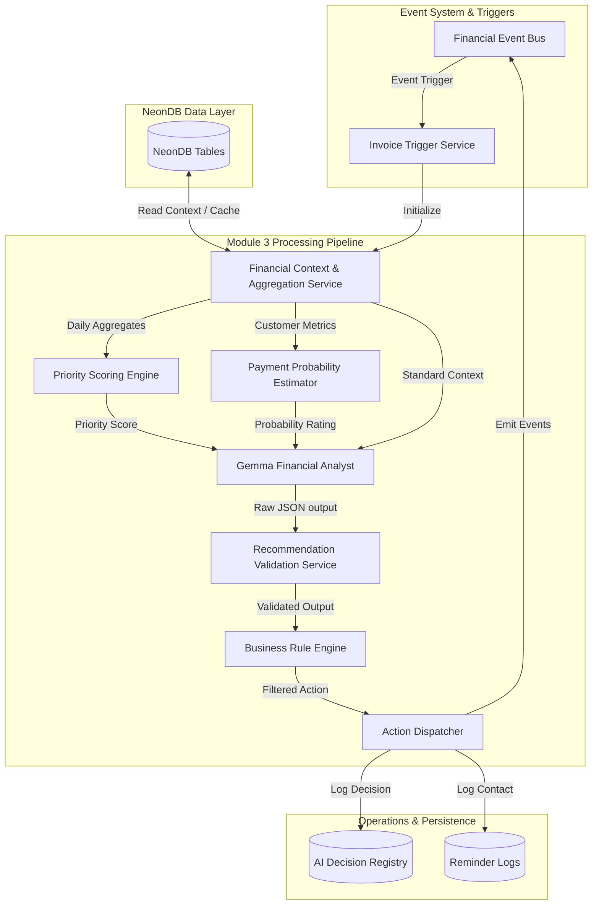

# SYSTEM ARCHITECTURE DESIGN SPECIFICATION
## MODULE 3: INTELLIGENT INVOICE FOLLOW-UP ENGINE

---

## 1. MODULE OVERVIEW

### 1.1 Mission & Objective
Module 3 (Intelligent Invoice Follow-up Engine) manages outstanding customer invoices (Accounts Receivable collections) for Manufacturing SMEs. Its core objective is to optimize collection timelines, minimize outstanding debt (Days Sales Outstanding, DSO), and maintain strong customer relationships. 

The engine uses a hybrid architectural approach:
* **Deterministic Core**: Calculations of priority, collections profiling, probability of payment, and enforcement of company policy rules are executed by deterministic code.
* **Generative Reasoning & Personalization (Gemma)**: Gemma is used only to analyze the context, choose the communication tone, draft emails, explain reasoning, and suggest follow-up schedules. It has no authority to make final decisions or calculate values.

---

## 2. ARCHITECTURE DIAGRAM

The diagram below details the data flow through Module 3:



---

## 3. DATA FLOW

1. **Trigger Activation**: The pipeline is initiated by database hooks or scheduled cron jobs (e.g. `Invoice Overdue` or `Daily Scheduler`).
2. **Context Aggregation**: The **Financial Context & Aggregation Service** queries NeonDB for current invoices, customer histories, and cash flow forecasts, caching results for performance.
3. **Deterministic Math Calculation**:
   * The **Priority Scoring Engine** calculates a collections priority score (0-100).
   * The **Payment Probability Estimator** calculates the probability of settlement (0-100%).
4. **AI Generation**: Gemma parses these scores alongside company collection policies to draft personalized follow-up emails and recommend next steps.
5. **Validation & Filtering**:
   * The **Recommendation Validation Service** ensures Gemma's output conforms to the required JSON schema.
   * The **Business Rule Engine** filters the recommendation against strict company parameters (e.g. max reminder limits, blacklist status).
6. **Execution & Auditing**: The **Action Dispatcher** executes the verified action (emailing, task creation, or manager escalation) and logs the step in the `AI Decision Registry` and `Reminder Logs`.

---

## 4. COMPONENT RESPONSIBILITIES

| Component | Responsibility | Constraints |
| :--- | :--- | :--- |
| **Invoice Trigger Service** | Evaluates triggers and initializes the collections pipeline. | None. |
| **Context Service** | Fetches and aggregates customer payment delay histories, balances, and cash projections. | Must implement tenant data isolation and strict caching. |
| **Priority Scoring Engine** | Computes the collections priority score (0-100). | **No AI**. Strict mathematical formulas. |
| **Payment Probability Estimator**| Computes payment probability (0-100%). | **No AI**. Rule-based statistical estimators. |
| **Gemma Financial Analyst** | Reasons about client patterns, drafts emails, and explains collections next steps. | **AI**. Prohibited from calculating values or overriding rules. |
| **Validation Service** | Checks Gemma's outputs for JSON schema compliance and valid date formats. | Must implement retry and fallback configurations. |
| **Business Rule Engine** | Enforces company compliance boundaries (max contact attempts, blacklist checks). | **No AI**. Hard checks that override LLM recommendations. |
| **Action Dispatcher** | Executes actions (emailing via scheduler, task creation) and logs audit records. | Triggers transactional DB commits. |

---

## 5. TRIGGER LIFECYCLE

The Invoice Trigger Service initiates follow-up operations based on these events:

1. **Invoice Created**: Initializes tracking for the invoice.
2. **Invoice Updated**: Checks for change conditions (e.g. dispute flags, installment revisions).
3. **Invoice Overdue**: Triggers immediate priority scoring and collections analysis.
4. **Daily Scheduler**: Executes a batch scan of all outstanding invoices to compile the daily collections queue.
5. **Manual Analyze**: Allows accounts receivable managers to trigger an instant analysis of specific client accounts.
6. **Payment Recorded**: De-escalates outstanding follow-ups, updates customer payment history metrics, and cancels scheduled reminders.
7. **Reminder Sent / Failed**: Updates communication metrics and schedules retries for failed delivery attempts.

---

## 6. FINANCIAL CONTEXT SERVICE DESIGN

The Context Service is organized into three logical layers:

```
+-----------------------------------------------------------------------------+
|                     Query Layer (Database Abstraction)                      |
| Reads: invoices, customers, bank balances, recurring profiles, forecasts    |
+------------------------------------+----------------------------------------+
                                     |
                                     v
+-----------------------------------------------------------------------------+
|                  Aggregation Layer (Metric Computations)                    |
| Computes: Average payment delay, late payment rate, days since last contact |
+------------------------------------+----------------------------------------+
                                     |
                                     v
+-----------------------------------------------------------------------------+
|                      Cache Layer (Redis / Memory)                           |
| Company-isolated caches with TTL constraints (e.g. 1 hour)                  |
+-----------------------------------------------------------------------------+
```

### 6.1 Calculated Metrics
* **Average Payment Delay ($D_c$)**: Average days past due date a customer settles invoices:
  $$D_c = \frac{1}{N} \sum (\text{Payment Date} - \text{Due Date})$$
* **Late Payment Percentage ($L_c$)**: Ratio of historical invoices paid late by the customer.
* **Days Since Last Reminder ($R_d$)**: Tracks intervals since the last communication.
* **Customer Reliability ($C_r$)**: Derived index representing customer payment consistency.

### 6.2 Caching Strategy
* **Why Caching is Required**: Prevents redundant database queries during batch runs, improving performance.
* **Company Isolation**: Cache keys are structured as `company:{company_id}:customer:{customer_id}:context` to prevent cross-tenant data leaks.
* **TTL Policy**: Cache entries have a 1-hour Time-To-Live (TTL) and are invalidated immediately when a payment event is processed.

---

## 7. PRIORITY SCORING ENGINE

The Priority Scoring Engine calculates a collections priority score (0-100) using a deterministic formula:

$$\text{Priority Score} = w_1 \cdot \text{Age Score} + w_2 \cdot \text{Amount Score} + w_3 \cdot \text{Risk Score} - w_4 \cdot \text{Tenure Score}$$

### 7.1 Weighting Rationale
* **Invoice Age ($w_1$)**: Older invoices are assigned higher priority to prevent them from becoming uncollectible.
* **Invoice Amount ($w_2$)**: High-value outstanding balances receive priority to mitigate impact on cash flow.
* **Customer Risk ($w_3$)**: Customers with high payment delay histories are prioritized.
* **Tenure ($w_4$)**: Long-term customers receive lower priority scores to allow for more relationship-oriented communication.

### 7.2 Score Classifications
* **Low (0 - 30)**: Normal payment window. Minimal follow-up required.
* **Medium (31 - 60)**: Invoice is approaching or slightly past due. Soft reminders scheduled.
* **High (61 - 85)**: Invoice is overdue. Formal collections process initiated.
* **Critical (86 - 100)**: Severely overdue invoice or customer default risk. Triggers immediate manager intervention.

---

## 8. PAYMENT PROBABILITY ESTIMATOR

This deterministic component calculates the probability of collection (0-100%):

$$\text{Probability} = 100\% - (\text{Base Late Factor} + \text{Age Penalty} + \text{Reminder Degradation})$$

Where:
* **Base Late Factor**: Derived from the customer's historical average payment delay.
* **Age Penalty**: Increases as the invoice ages past its due date.
* **Reminder Degradation**: Calculated from the failure rate of previous reminder attempts.

### 8.1 Usage by Gemma
Gemma parses the payment probability to customize communication tone. If probability is high (e.g. 90%), Gemma drafts a soft reminder. If probability is low (e.g. 15%), it recommends formal collections or legal escalation.

---

## 9. GEMMA FINANCIAL ANALYST

Gemma serves as the cognitive reasoning layer for Module 3:

```
========================= GEMMA ANALYST PROMPT STRUCTURE =========================
INPUT CONTEXT:
  - Priority Score: 78 (High)
  - Payment Probability: 35% (Low)
  - Invoice Age: 45 Days Overdue
  - Customer: Laser cutting client (Disputed order in June)
  - Liquidity Forecast: SME projects cash deficit in 15 days
  - Company Policy: Default Net 30, formal reminder after 14 days

OUTPUT JSON SCHEMA REQUIREMENT:
  {
    "recommended_action": "SEND_REMINDER" | "ESCALATE" | "WAIT",
    "tone": "FORMAL" | "COLLABORATIVE" | "URGENT",
    "email_body": "...",
    "next_followup_date": "YYYY-MM-DD",
    "reasoning": "...",
    "approval_required": true
  }
==================================================================================
```

### 9.1 LLM Safety Boundaries
To prevent hallucinations or calculations errors:
* Gemma is prohibited from calculating invoice balances or totals.
* Gemma cannot modify validation checks or override company payment rules.
* If Gemma's output violates database constraints, it is rejected by the validation service.

---

## 10. RECOMMENDATION VALIDATION SERVICE

The validation layer inspects Gemma's output:
1. **JSON Parser Validation**: Asserts that the response is valid JSON.
2. **Schema Matching**: Confirms presence of all required fields.
3. **Format Checks**: Validates that target dates match `YYYY-MM-DD` and are set in the future.
4. **Retry Mechanism**: If validation fails, the service requests a new generation from Gemma (up to 3 retries).
5. **Fallback Action**: If retries are exhausted, the system defaults to a deterministic fallback action: `recommended_action = "WAIT"`, `approval_required = true`, logging a validation error.

---

## 11. BUSINESS RULE ENGINE

The Business Rule Engine enforces company policy boundaries:
* **Minimum Communication Interval**: Reminders cannot be sent within 7 days of the previous contact.
* **Maximum Reminder Count**: Defer to legal escalation after 5 reminders.
* **Legal Hold Check**: Aborts communication if the customer is marked under `LEGAL_HOLD`.
* **Tenant Isolation**: Verifies that the invoice and customer records belong to the active company tenant.

---

## 12. ACTION DISPATCHER

The Action Dispatcher routes approved recommendations:

* **Wait**: Updates metadata and schedules a review scan for a future date.
* **Send Reminder**:
  * **Email**: Formats and sends the message using the company's email service.
  * **Dashboard Task**: For phone follow-ups, creates a task in the SME collections dashboard.
* **Escalate**:
  * **Manager Approval**: Routes critical alerts to the manager's review queue.
  * **Legal Review**: Flags the record as under legal dispute, locking out automated reminders.

---

## 13. AI DECISION REGISTRY

Stores every decision execution for compliance and audit logs:

```sql
CREATE TABLE ai_decision_registry (
    id UUID PRIMARY KEY DEFAULT uuid_generate_v4(),
    company_id UUID NOT NULL REFERENCES companies(id) ON DELETE CASCADE,
    invoice_id UUID NOT NULL REFERENCES invoices(id) ON DELETE CASCADE,
    run_timestamp TIMESTAMP WITH TIME ZONE DEFAULT CURRENT_TIMESTAMP,
    priority_score INT NOT NULL,
    payment_probability DECIMAL(5,2) NOT NULL,
    raw_prompt_context TEXT NOT NULL,
    gemma_recommendation JSONB NOT NULL,
    final_action_dispatched VARCHAR(100) NOT NULL,
    user_override BOOLEAN DEFAULT FALSE,
    outcome VARCHAR(255)
);
```

### 13.1 Importance of the Registry
* **Audit Compliance**: Provides an audit trail of automated communications.
* **Continuous Improvement**: Downstream accuracy engines analyze this registry to evaluate the impact of different communication tones on collection performance.

---

## 14. REMINDER LOGS

Maintains a history of customer communications:

```sql
CREATE TABLE reminder_logs (
    id UUID PRIMARY KEY DEFAULT uuid_generate_v4(),
    invoice_id UUID NOT NULL REFERENCES invoices(id) ON DELETE CASCADE,
    reminder_date TIMESTAMP WITH TIME ZONE DEFAULT CURRENT_TIMESTAMP,
    reminder_type VARCHAR(50) NOT NULL, -- SOFT, REGULAR, URGENT, PHONE_CALL
    communication_channel VARCHAR(50) NOT NULL, -- EMAIL, SMS, MANUAL_CALL
    delivery_status VARCHAR(50) NOT NULL, -- DELIVERED, FAILED, READ
    response_received TEXT,
    next_scheduled_reminder DATE
);
```

* **Usage**: The Context Service references `reminder_logs` to calculate the interval since the last communication, preventing spam.

---

## 15. FINANCIAL EVENT FLOW

Module 3 publishes events to the platform's Event Bus:
* `Reminder Sent`: Subscribed to by Audit logs to update historical timelines.
* `Reminder Failed`: Triggers alert emails to accounts receivable managers.
* `Invoice Escalated`: Triggers notification events in the manager dashboard.
* `Task Created`: Updates workspace TODO lists for accounts receivable staff.

---

## 16. MODULE OUTPUTS

Every execution run of Module 3 produces:
1. A calculated **Priority Score** (0-100).
2. A calculated **Payment Probability** (0-100%).
3. A structured collections action (`WAIT`, `SEND_REMINDER`, `ESCALATE`).
4. An email body draft with a defined communication tone.
5. Entries in the `ai_decision_registry` and `reminder_logs` tables.

---

## 17. DESIGN DECISIONS & RATIONALE

* **Deterministic Validation**: Business rules override LLM recommendations. For example, if Gemma recommends sending a reminder, but the company policy restricts contact to once per week, the Business Rule Engine overrides the recommendation to `WAIT`.
* **Structured Prompts**: By enforcing a JSON output format, Gemma can be integrated into automated software workflows.
* **Tenant Isolation**: Database rows are filtered by `company_id` to prevent cross-tenant data leaks.

---

## 18. SYSTEM FLOW DIAGRAM

```
+---------------------------------------------------------------------------------------------------+
|                                      FINANCIAL EVENT BUS / CRON                                   |
+---------------------------------------------------------------------------------------------------+
|                                                                                                   |
|    Invoice Overdue / Daily Cron Ingestion Trigger                                                 |
|          |                                                                                        |
|          v                                                                                        |
|  (Context & Aggregator)  ====> Selects invoice, customer metrics, and cash forecasts from NeonDB |
|          |                                                                                        |
|          +-----------------------------+-----------------------------+                            |
|          |                             |                             |                            |
|          v [Financial context]         v [Payment records]           v [Balances]                 |
|  (Priority Scoring Engine)     (Payment Prob. Estimator)     (Cache Layer validation)             |
|    - Priority: 0-100 (Math)      - Prob: 0-100% (Math)         - TTL: 1 hr                        |
|          |                             |                             |                            |
|          +-----------------------------+-----------------------------+                            |
|                                        |                                                          |
|                                        v [Deterministic Data Inputs]                              |
|                            (Gemma Financial Analyst)                                              |
|                               - Generates recommended action, tone, and email draft               |
|                                        |                                                          |
|                                        v [Gemma Output payload]                                   |
|                        (Recommendation Validation Service)                                        |
|                               - Asserts JSON schema constraints; executes retry logic             |
|                                        |                                                          |
|                                        v [Validated JSON]                                         |
|                             (Business Rule Engine)                                                |
|                               - Enforces max contact limits, blacklist, and tenant policies       |
|                                        |                                                          |
|                                        v [Approved Action Payload]                                |
|                               (Action Dispatcher)                                                 |
|                                        |                                                          |
|          +-----------------------------+-----------------------------+                            |
|          |                             |                             |                            |
|          v                             v                             v                            |
|  [ ai_decision_registry ]       [ reminder_logs ]             [ Event Bus Publication ]           |
|  - Log priority & score         - Log contact method          - Emit "Reminder Sent" event        |
|  - Save Gemma prompt            - Log next due date           - Downstream dashboards update      |
|                                                                                                   |
+---------------------------------------------------------------------------------------------------+
```
