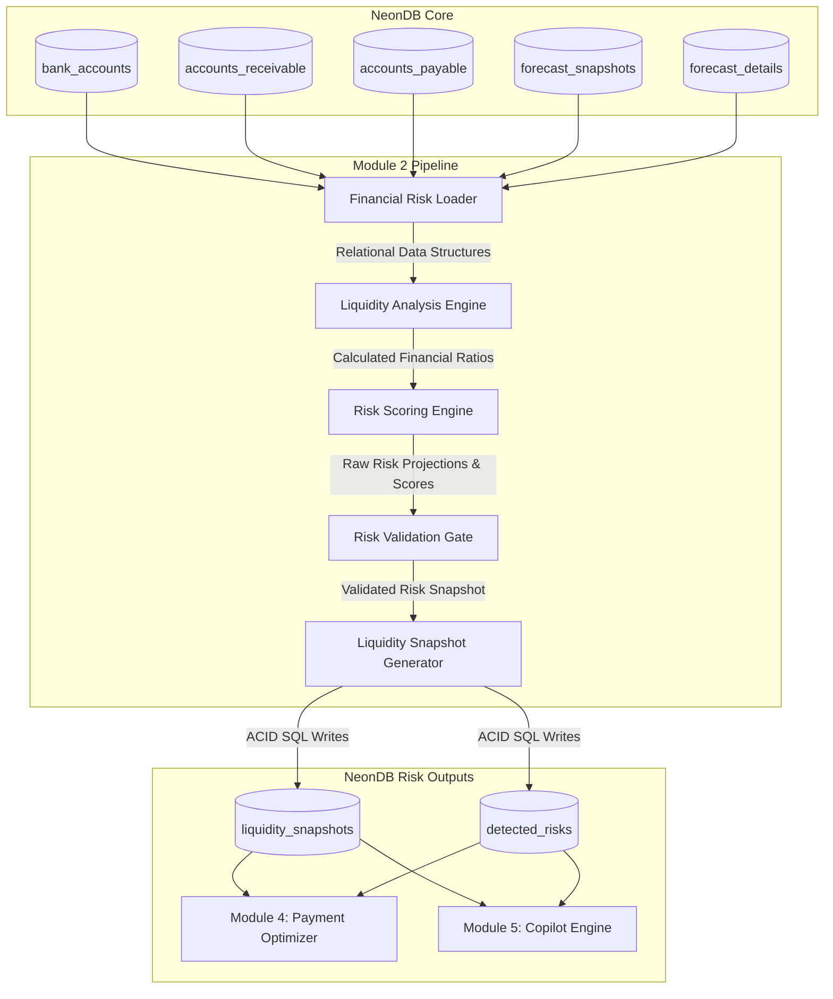

# SYSTEM ARCHITECTURE DESIGN SPECIFICATION
## MODULE 2: DETERMINISTIC LIQUIDITY RISK ENGINE

---

## 1. MODULE OVERVIEW

### 1.1 Scope & Purpose
Module 2 (Liquidity Risk Engine) evaluates the short-term and medium-term solvency of the Manufacturing SME. It acts as an early warning system, analyzing active financial structures (receivables, payables, liabilities) in combination with the deterministic cash flow projections generated by Module 1. By executing deterministic financial checks, Module 2 identifies operational threats (such as upcoming payroll deficits, raw material PO coverage issues, and cash buffer breaches) and logs them into NeonDB.

### 1.2 Boundary Constraints
* **No AI / Gemma Involvement**: Risk evaluations and scoring are performed using deterministic cash flow equations and logic thresholds. Natural language parsing, LLM logic, and fuzzy reasoning are excluded to ensure auditability and compliance.
* **Structured Inputs Only**: Module 2 reads only structured tables from NeonDB (e.g. `forecast_snapshots`, `accounts_payable`, `loans`) and writes structured outputs back to `liquidity_snapshots` and `detected_risks`.

---

## 2. ARCHITECTURE DIAGRAM

The pipeline below represents the database-centric execution flow of Module 2:



---

## 3. DATA FLOW

1. **Risk Ingest (Data Loading)**: The **Financial Risk Loader** queries NeonDB to retrieve the most recent cash flow forecasts from `forecast_snapshots` and `forecast_details`, alongside current account balances, due receivables, and scheduled payables.
2. **Ratio Computation**: The **Liquidity Analysis Engine** calculates core financial liquidity ratios (e.g. Working Capital, Cash Buffer, Cash Runway) for 7, 30, and 90-day windows.
3. **Risk Scoring**: The **Risk Scoring Engine** evaluates these ratios against threshold rules to assign a Liquidity Score and classify the risk level (Low, Medium, High, Critical).
4. **Validation Scan**: The **Risk Validation Gate** checks for calculations anomalies, outdated forecasts, or missing ledger parameters.
5. **Database Persistence**: The **Liquidity Snapshot Generator** writes the verified scores and flagged issues to the `liquidity_snapshots` and `detected_risks` tables in NeonDB.

---

## 4. COMPONENT RESPONSIBILITIES

### 4.1 Financial Risk Loader
* **Role**: Database broker for the risk assessment engine.
* **Responsibilities**:
  * Loads the latest cash flow forecast header and details.
  * Queries open accounts receivable and accounts payable balances.
  * Fetches current bank statement levels and physical register counts.
  * Retrieves upcoming fixed costs (payroll, loan EMIs, machine AMCs).

### 4.2 Liquidity Analysis Engine
* **Role**: Computes operational liquidity metrics.
* **Responsibilities**:
  * Calculates working capital availability.
  * Measures the projected cash buffer (minimum cash balance during the forecast window).
  * Estimates the cash runway (number of days before the projected cash balance drops below zero).
  * Computes customer collection coverage ratios against open payables.

### 4.3 Risk Scoring Engine
* **Role**: Translates financial metrics into risk classifications.
* **Responsibilities**:
  * Formulates a deterministic Liquidity Score based on cash runway days and cash buffer metrics.
  * Assigns Risk Levels (Low, Medium, High, Critical) using business rule thresholds.
  * Flags specific risk conditions (e.g. "Payroll Risk", "Vendor Payment Risk").

### 4.4 Risk Validation Gate
* **Role**: Pipeline safety inspector.
* **Responsibilities**:
  * Ensures that a recently generated forecast snapshot is available in the database before running risk calculations.
  * Flags calculation anomalies (e.g., negative working capital ratios that violate mathematical bounds).
  * Quarantine analysis records if essential balance figures are missing.

### 4.5 Liquidity Snapshot Generator
* **Role**: relational DB writer.
* **Responsibilities**:
  * Serializes risk results into database insert transactions.
  * Writes to the `liquidity_snapshots` and `detected_risks` tables in NeonDB.
  * Emits alerts to system audit trails if critical risk states are detected.

---

## 5. LIQUIDITY ANALYSIS PIPELINE

### 5.1 Deterministic Financial Indicators
The Liquidity Analysis Engine calculates these indicators for the SME:

* **Current Liquidity Position**: Total immediate cash available across all bank accounts and physical cash boxes.
* **Working Capital**: Current quick assets minus current quick liabilities due within the horizon:
  $$\text{Working Capital}_{[t]} = \text{Immediate Cash} + \text{Receivables due within } t - \text{Payables due within } t$$
* **Cash Buffer**: The absolute minimum projected cash balance during the forecast horizon:
  $$\text{Cash Buffer}_{[t]} = \min_{1 \le d \le t} (\text{Projected Cash Balance}_d)$$
* **Cash Runway**: The number of days before the projected cash balance falls below zero:
  $$\text{Cash Runway} = d \quad \text{where} \quad \text{Projected Balance}_d < 0 \quad \text{and} \quad \text{Projected Balance}_{d-1} \ge 0$$
* **Receivable Coverage Ratio**:
  $$\text{Receivable Coverage}_{[t]} = \frac{\sum \text{Receivables due within } t}{\sum \text{Payables due within } t}$$
  If this ratio is less than 1.0, the SME is reliant on external financing or cash reserves to settle short-term payables.

---

### 5.2 Risk Scoring Engine Math
The engine calculates a **Liquidity Score** (0 to 100) using a deterministic step function. The score represents the overall financial health of the SME:

$$\text{Score} = w_1 \cdot \text{Runway Score} + w_2 \cdot \text{Buffer Score} + w_3 \cdot \text{Coverage Score}$$

Where:
* **Runway Score**: Derived from the cash runway. If runway $\ge$ 90 days, score is 100. If runway $<$ 7 days, score is 0.
* **Buffer Score**: Derived from the cash buffer. If the projected buffer remains above the safety limit, score is 100. If it falls below zero, score is 0.
* **Coverage Score**: Derived from the receivable coverage ratio.

#### Risk Level Classifications:
* **Low (Score $\ge 80$)**: Cash runway exceeds 60 days; cash buffers remain above the safety threshold.
* **Medium ($50 \le \text{Score} < 80$)**: Cash runway is between 30 and 60 days; minor cash buffer breaches are projected.
* **High ($20 \le \text{Score} < 50$)**: Cash runway is between 7 and 30 days; upcoming vendor payment defaults are projected.
* **Critical (Score $< 20$)**: Cash runway is less than 7 days; immediate payroll or loan default is projected.

---

### 5.3 Risk Detection Logic
The engine flags specific operational threats using boolean rule checks:
* **Cash Deficit**: Triggered if $\text{Projected Cash Balance}_t < 0$ at any day in the horizon.
* **Payroll Risk**: Triggered if the projected cash balance on a payroll processing date is less than the net payroll obligation:
  $$\text{Projected Cash Balance}_{\text{payroll\_date}} < \text{Net Payroll Amount}$$
* **Vendor Payment Risk**: Triggered if the expected cash balance is insufficient to cover payables past their discount terms or credit due dates.
* **Cash Buffer Breach**: Triggered if $\text{Cash Buffer} < \text{Company Safety Threshold}$.
* **High Outstanding Receivables**: Triggered if receivables past due exceed 40% of the total assets, indicating collection issues (Module 3 targets).

---

### 5.4 Risk Validation Checks
To ensure data integrity, the validation layer executes these controls:
* **Forecast Availability Check**: Risk calculations must reference a `forecast_snapshot` generated within the last 24 hours. If no recent forecast is found, the process aborts.
* **Balance Consistency Check**: Validates that bank balances do not show unexplained changes (e.g. a sudden 90% decrease in cash assets) that could indicate statement import issues.
* **Resolution of Failures**: If validation fails, no record is written to the operational risk tables. The failure is logged in `system_audit_trail`, and the previous risk state is preserved.

---

## 6. LIQUIDITY SNAPSHOTS DESIGN

Completed risk analyses are stored in these NeonDB schemas:

```sql
-- 1. LIQUIDITY SNAPSHOTS (Summary of the risk assessment run)
CREATE TABLE liquidity_snapshots (
    id UUID PRIMARY KEY DEFAULT uuid_generate_v4(),
    company_id UUID NOT NULL REFERENCES companies(id) ON DELETE CASCADE,
    forecast_snapshot_id UUID NOT NULL REFERENCES forecast_snapshots(id) ON DELETE CASCADE,
    run_timestamp TIMESTAMP WITH TIME ZONE DEFAULT CURRENT_TIMESTAMP,
    liquidity_score INT NOT NULL CHECK (liquidity_score BETWEEN 0 AND 100),
    risk_level VARCHAR(20) NOT NULL, -- LOW, MEDIUM, HIGH, CRITICAL
    working_capital DECIMAL(15, 2) NOT NULL,
    cash_buffer DECIMAL(15, 2) NOT NULL,
    cash_runway_days INT, -- NULL if infinite
    receivable_coverage DECIMAL(5, 2) NOT NULL,
    created_at TIMESTAMP WITH TIME ZONE DEFAULT CURRENT_TIMESTAMP
);

-- 2. DETECTED RISKS (Detailed log of flagged threats)
CREATE TABLE detected_risks (
    id UUID PRIMARY KEY DEFAULT uuid_generate_v4(),
    liquidity_snapshot_id UUID NOT NULL REFERENCES liquidity_snapshots(id) ON DELETE CASCADE,
    risk_type VARCHAR(50) NOT NULL, -- PAYROLL_RISK, CASH_DEFICIT, VENDOR_PAYMENT_RISK, BUFFER_BREACH
    threat_level VARCHAR(20) NOT NULL, -- MEDIUM, HIGH, CRITICAL
    target_date DATE NOT NULL, -- Date when the risk is projected to materialize
    description TEXT NOT NULL,
    created_at TIMESTAMP WITH TIME ZONE DEFAULT CURRENT_TIMESTAMP
);
```

### 6.1 Importance of Historical Liquidity Snapshots
* **Historical Trend Analysis**: Allows the platform to track the SME's risk profile over time. A upward trend in the liquidity score indicates improving financial health.
* **Credit Compliance Reporting**: Banks and trade creditors often require historical liquidity sheets to evaluate financing terms or lines of credit for machinery purchases.

### 6.2 Downstream Consumption
* **Module 4 (Payment Schedule Optimizer)**:
  * Reads the active `detected_risks` table.
  * If a `VENDOR_PAYMENT_RISK` is flagged on a specific date, Module 4 adjusts the payment schedule to defer non-critical bills, prioritizing critical vendor payments to preserve supplier relations.
* **Module 5 (Financial Copilot)**:
  * Reads both tables to construct real-time dashboard notifications and answer user queries (e.g. "What are my main financial risks this month?").

---

## 7. MODULE DEPENDENCIES

* **Module 1 (Forecasting)**: Provides the cash flow projections that populate the `forecast_snapshots` and `forecast_details` tables.
* **NeonDB**: Stores all inputs and outputs, serving as the interface between the forecasting and risk engine modules.
* **Module 4 (Optimizer)**: Reads the generated `liquidity_snapshots` and `detected_risks` to schedule and optimize vendor bills.

---

## 8. DESIGN DECISIONS & RATIONALE

* **Frictionless Decoupling**: Module 2 does not query Module 1's memory space or API. Instead, it reads the outputs written by Module 1 to NeonDB, ensuring the engine can run independently.
* **Relational Storage over JSON Document Streams**: Detected risks are stored as individual rows in `detected_risks` rather than a list inside a JSON column. This allows Module 4 to easily join invoices with their associated risk flags.
* **Safety Threshold Customization**: The `cash_buffer` check references a dynamic `safety_threshold` stored in the company's profile, allowing the risk engine to adapt to different company sizes and operational reserves.

---

## 9. COMPLETE SYSTEM DIAGRAM

```
+---------------------------------------------------------------------------------------------------+
|                                      NEON OPERATIONAL DATABASE                                    |
+---------------------------------------------------------------------------------------------------+
|                                                                                                   |
|    +-----------------+        +-----------------+        +-----------------+                      |
|    |  bank_accounts  |        |accounts_pay/rec |        |forecast_details |                      |
|    +--------+--------+        +--------+--------+        +--------+--------+                      |
|             |                          |                          |                               |
+-------------+--------------------------+--------------------------+-------------------------------+
              |                          |                          |
              | (Select Raw Data Vectors)|                          |
              v                          v                          v
+---------------------------------------------------------------------------------------------------+
|                                 MODULE 2 - LIQUIDITY RISK ENGINE                                  |
+---------------------------------------------------------------------------------------------------+
|                                                                                                   |
|   (Financial Risk Loader)     =======> Loads bank statements, AR/AP, and cash flow forecasts      |
|              |                                                                                    |
|              v [Asset & Liability Vectors]                                                        |
|   (Liquidity Analysis Engine) =======> Computes working capital, runways, and coverage ratios     |
|              |                                                                                    |
|              v [Liquidity Indicators]                                                             |
|   (Risk Scoring Engine)       =======> Calculates Liquidity Score and flags specific risk vectors  |
|              |                                                                                    |
|              v [Risk Outputs & Scores]                                                            |
|   (Risk Validation Gate)      =======> Validates forecast availability and mathematical bounds    |
|              |                                                                                    |
|              v [Validated Metrics]                                                                |
|   (Snapshot Generator)        =======> Commits risk snapshots to NeonDB                           |
|              |                                                                                    |
+--------------+------------------------------------------------------------------------------------+
               |
               | (ACID PostgreSQL commit)
               v
+---------------------------------------------------------------------------------------------------+
|                                      NEON OPERATIONAL DATABASE                                    |
+---------------------------------------------------------------------------------------------------+
|                                                                                                   |
|                                   +---------------------+                                         |
|                                   | liquidity_snapshots |                                         |
|                                   +----------+----------+                                         |
|                                              |                                                    |
|                                              v (1:N Link)                                         |
|                                   +---------------------+                                         |
|                                   |   detected_risks    |                                         |
|                                   +----------+----------+                                         |
|                                              |                                                    |
|                                              +-----------------------+                            |
|                                              |                       |                            |
|                                              v                       v                            |
|                                     [Module 4 Engine]       [Module 5 Engine]                     |
|                                     (Payment Optimizer)     (Financial Copilot)                   |
|                                                                                                   |
+---------------------------------------------------------------------------------------------------+
```
