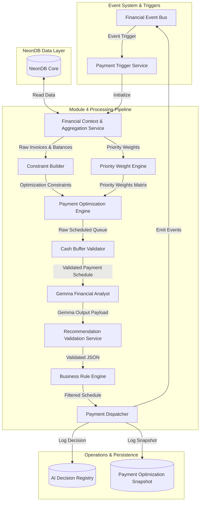

# SYSTEM ARCHITECTURE DESIGN SPECIFICATION
## MODULE 4: INTELLIGENT PAYMENT SCHEDULE OPTIMIZATION ENGINE

---

## 1. MODULE OVERVIEW

### 1.1 Scope & Mission
Module 4 (Intelligent Payment Schedule Optimization Engine) manages outgoing cash flows (Accounts Payable) for Manufacturing SMEs. Its core objective is to maximize discount opportunities (early payment savings) and minimize penalty fees while preserving the company's baseline cash reserves (cash buffer). 

To ensure treasury security and accountability:
* **Deterministic Optimization Core**: All allocations, schedule scheduling, constraint mappings, and balance calculations are performed by deterministic operations research algorithms.
* **Gemma/LLM Boundary**: Gemma is used only to interpret the optimized schedule, explain the reasoning behind delayed or split payments, and write executive summaries for management. It has no authority to build schedules, modify values, or override validation gates.

---

## 2. ARCHITECTURE DIAGRAM

The pipeline below details the data flow through Module 4:



---

## 3. DATA FLOW

1. **Triggering**: Events like `Vendor Bill Created` or `Daily Scheduler` initiate the optimization run.
2. **Context Aggregation**: The **Financial Context & Aggregation Service** loads outstanding vendor bills, current bank balances, and the cash flow forecasts from Module 1.
3. **Deterministic Math Calculation**:
   * The **Constraint Builder** translates company policies (e.g. minimum cash buffer, max daily payment limits) into mathematical boundary rules.
   * The **Priority Weight Engine** converts user-defined categories (e.g. Priority 1 for raw materials, Priority 4 for software) into coefficient matrices.
   * The **Payment Optimization Engine** executes optimization math to compile the schedule.
   * The **Cash Buffer Validator** runs simulation tests to confirm that no combination of scheduled payments drops the daily cash balance below zero.
4. **AI Generation**: Gemma parses the optimized queue and drafts explanation notes and risk summaries.
5. **Validation & Filtering**:
   * The **Recommendation Validation Service** ensures Gemma's output matches the required JSON structure.
   * The **Business Rule Engine** filters the recommendation against strict company parameters.
6. **Execution & Auditing**: The **Payment Dispatcher** schedules or routes payments for approval, writing logs to the `AI Decision Registry` and `Payment Optimization Snapshot`.

---

## 4. COMPONENT RESPONSIBILITIES

| Component | Responsibility | Constraints |
| :--- | :--- | :--- |
| **Payment Trigger Service** | Evaluates triggers and initiates the payment optimization loop. | None. |
| **Context Service** | Retrieves cash positions, forecasts, outstanding bills, and vendor terms. | Enforces company data isolation. |
| **Constraint Builder** | Formulates financial boundary parameters (minimum cash limits, payment caps). | **No AI**. Rule-based constraints. |
| **Priority Weight Engine** | Maps business categories to optimization coefficients. | **No AI**. Pre-configured weights. |
| **Payment Optimization Engine**| Solves the payment scheduling problem, maximizing discounts and minimizing fees. | **No AI**. Linear optimization models. |
| **Cash Buffer Validator** | Simulates cash balances to confirm that no daily projection drops below the safety buffer. | **No AI**. Absolute validation gate. |
| **Gemma Financial Analyst** | Explains the optimized schedule, detailing why certain payments are delayed. | **AI**. Prohibited from calculating values or schedules. |
| **Validation Service** | Checks Gemma's outputs for JSON schema compliance. | Must implement retry and fallback configurations. |
| **Business Rule Engine** | Enforces company compliance boundaries (max daily payment limits). | **No AI**. Hard checks. |
| **Payment Dispatcher** | Schedules payments (autopay queue, manual approvals) and writes audit logs. | Triggers transactional DB updates. |

---

## 5. TRIGGER LIFECYCLE

The Payment Trigger Service initiates optimization runs based on these events:
* **Vendor Bill Created / Updated**: Adds or updates pending liabilities in the optimization pool.
* **Payment Due Date Approaching**: Scans vendor bills due within 3 days to prioritize processing.
* **Cash Position Updated**: Re-evaluates payment windows if a large bank deposit or withdrawal is detected.
* **Forecast / Liquidity Updated**: Re-calculates cash runways and safety buffers based on new projections.
* **Manual Optimize**: Allows treasury managers to trigger an instant optimization run.
* **Daily Scheduler**: Executes a daily batch optimization to compile the morning payment queue.
* **Payment Completed**: Updates invoice status and reconciles balances.

---

## 6. CONSTRAINT BUILDER

The Constraint Builder converts financial policies and database metrics into mathematical optimization constraints:
* **Minimum Cash Buffer ($B_{\text{min}}$)**: Enforces that the projected cash balance on any day $d$ in the horizon $T$ must remain above the safety threshold:
  $$\text{Cash Balance}_d \ge B_{\text{min}} \quad \forall d \in T$$
* **Maximum Daily Payment Cap ($P_{\text{max}}$)**: Limits total cash outflow on any single day to prevent bank overdraft limits:
  $$\sum \text{Payments}_d \le P_{\text{max}} \quad \forall d \in T$$
* **Vendor Deadlines ($D_v$)**: Enforces that payments must be scheduled on or before the due date to avoid penalties:
  $$\text{Payment Date}_i \le D_v$$
* **Payroll & Debt Protection**: Payroll dates and loan repayment dates are marked as absolute, non-deferrable constraints.
* **Why Optimization is Constraint-Driven**: Small manufacturing businesses operate on tight working capital margins. Using constraint-driven logic ensures that optimizing for supplier discounts does not inadvertently drain the payroll account.

---

## 7. PRIORITY WEIGHT ENGINE

The priority weights define the coefficient matrix used by the optimizer:

| Priority Level | Target Categories | Optimization Weight ($w_p$) | Deferral Flexibility |
| :--- | :--- | :---: | :--- |
| **Priority 1 (Critical)** | Taxes, Factory Payroll, Critical Raw Materials (Steel stock). | 1000 | Non-deferrable. |
| **Priority 2 (Strategic)** | Primary Machining Vendors, Tooling Suppliers. | 500 | Max 5-day deferral. |
| **Priority 3 (Utilities)** | Electricity, Gas, Factory Rent. | 100 | Deferrable with minor fee. |
| **Priority 4 (Discretionary)**| Marketing, Software Subscriptions, Travel. | 10 | High deferral flexibility. |

### 7.1 Weighting Influence
The optimizer multiplies the priority weight by the payment value. Priority 1 payments are scheduled first, while Priority 4 payments are delayed if cash reserves approach the minimum safety buffer.

---

## 8. PAYMENT OPTIMIZATION ENGINE

The core deterministic engine schedules payments to achieve three objectives:
1. Maximize early payment discounts captured.
2. Minimize late payment penalties incurred.
3. Maximize priority-weighted vendor relationships preserved.

### 8.1 Optimization Output Categories
* **Automated Payments**: Routine, low-priority, or standard discount bills (e.g. recurring software, standard utilities) scheduled for auto-debit.
* **Approval Required Payments**: High-value bills, critical raw material invoices, or payments scheduled near the safety buffer that require manual manager authorization.
* **Delayed Payments**: Non-critical bills scheduled for deferral due to projected cash constraints.

---

## 9. CASH BUFFER VALIDATOR

The Cash Buffer Validator acts as a final safety check:
* **Simulation Loop**: Simulates daily cash balances by applying the optimized payment queue against current bank balances.
* **Constraint Check**: Verifies that the cash balance on any day $d$ remains above the safety buffer:
  $$\text{Projected Balance}_d \ge B_{\text{min}}$$
* **Why Validation is Required**: The optimization solver could arrive at a mathematically optimal solution that temporarily dips balances below the safety threshold during mid-day processing. The validator catches these dips and rejects the schedule, forcing the solver to recalculate.

---

## 10. GEMMA FINANCIAL ANALYST

Gemma provides the natural language interpretation of the optimized schedule:

```
========================= GEMMA PROMPT INPUT =========================
OPTIMIZED PAYMENT QUEUE:
  - Total Payments Scheduled: $45,000 (12 Invoices)
  - Delayed Payments: $12,500 (3 Invoices - Software, AMC, Office Supplies)
  - Critical Payments: $25,000 (Steel Stock Invoice - Discount captured)
  - Cash Buffer: Maintained at $15,000 (Safety limit: $10,000)

GOAL: Explain why payments were delayed and verify business impact.
======================================================================
```

### 10.1 Output Payload Requirements
Gemma must return a structured JSON response containing:
* `executive_summary`: Concise overview of the payment run.
* `delay_explanation`: Rationale for why specific invoices were delayed.
* `business_impact`: Expected impact on cash buffers and vendor relationships.
* `approval_recommendation`: Flag indicating if the run requires manager approval.

---

## 11. RECOMMENDATION VALIDATION SERVICE

The validation layer inspects Gemma's output:
1. **JSON Parser Validation**: Asserts that the response is valid JSON.
2. **Schema Matching**: Confirms presence of all required fields.
3. **Format Checks**: Validates that target dates match `YYYY-MM-DD`.
4. **Retry Mechanism**: If validation fails, the service requests a new generation from Gemma (up to 3 retries).
5. **Fallback Action**: If retries are exhausted, the system defaults to a deterministic fallback action: `recommended_action = "MANUAL_REVIEW"`, `approval_required = true`, logging a validation error.

---

## 12. BUSINESS RULE ENGINE

The Business Rule Engine enforces company payment policies:
* **Max Daily Payment Check**: Verifies that the total payment run does not exceed the daily banking limit.
* **Approval Requirements**: Enforces that any payment run exceeding \$10,000 requires two-factor manager approval.
* **Automatic Payment Eligibility**: Confirms that only pre-approved vendor accounts are included in the automated payment queue.

---

## 13. PAYMENT DISPATCHER

The Payment Dispatcher routes approved recommendations:
* **Schedule Payment**: Adds the invoice to the automated payment scheduler (`Auto Payment Queue`).
* **Delay Payment**: Updates the invoice status to `DEFERRED` and schedules a review date.
* **Manager Approval**: Places high-value or high-risk payments in the manager's review queue.
* **Immediate Payment**: Dispatches the payment transaction directly to the bank API.

---

## 14. AI DECISION REGISTRY

Stores every decision execution for compliance and audit logs:

```sql
CREATE TABLE payment_optimization_registry (
    id UUID PRIMARY KEY DEFAULT uuid_generate_v4(),
    company_id UUID NOT NULL REFERENCES companies(id) ON DELETE CASCADE,
    run_timestamp TIMESTAMP WITH TIME ZONE DEFAULT CURRENT_TIMESTAMP,
    input_data_hash VARCHAR(64) NOT NULL,
    priority_weights JSONB NOT NULL,
    gemma_explanation TEXT NOT NULL,
    final_dispatcher_action VARCHAR(100) NOT NULL,
    user_override_flag BOOLEAN DEFAULT FALSE,
    execution_status VARCHAR(50) NOT NULL
);
```

* **Usage**: Provides an audit trail for financial reviews and compliance checks.

---

## 15. PAYMENT OPTIMIZATION SNAPSHOT

Stores the results of each optimization run:

```sql
CREATE TABLE payment_optimization_snapshots (
    id UUID PRIMARY KEY DEFAULT uuid_generate_v4(),
    company_id UUID NOT NULL REFERENCES companies(id) ON DELETE CASCADE,
    snapshot_timestamp TIMESTAMP WITH TIME ZONE DEFAULT CURRENT_TIMESTAMP,
    current_cash_position DECIMAL(15, 2) NOT NULL,
    projected_liquidity_score INT NOT NULL,
    forecast_reference_id UUID REFERENCES forecast_snapshots(id) ON DELETE SET NULL,
    automated_payments_count INT NOT NULL,
    delayed_payments_count INT NOT NULL,
    approval_required_count INT NOT NULL
);
```

* **Usage**: Retained to track optimization performance over time (e.g. measuring total discount savings captured).

---

## 16. FINANCIAL EVENT FLOW

Module 4 publishes events to the Event Bus:
* `Payment Scheduled`: Subscribed to by the cash flow forecast engine to update future projections.
* `Payment Delayed`: Triggers warnings to accounts payable staff.
* `Manager Approval Requested`: Triggers notification events in the manager dashboard.
* `Cash Buffer Alert`: Sent to the risk engine if the cash balance approaches the safety threshold.

---

## 17. MODULE OUTPUTS

Every execution run of Module 4 produces:
1. An **Optimized Payment Queue** containing recommended payment dates.
2. An **Automated Payment List** for pre-approved vendors.
3. An **Approval Queue** for high-value or high-risk transactions.
4. A **Delayed Payment List** with new target scheduling dates.
5. Entries in the `payment_optimization_snapshots` and `payment_optimization_registry` tables.

---

## 18. DESIGN DECISIONS & RATIONALE

* **Deterministic Validation**: Business rules override LLM recommendations. For example, if Gemma recommends sending a reminder, but the company policy restricts contact to once per week, the Business Rule Engine overrides the recommendation to `WAIT`.
* **Structured Prompts**: By enforcing a JSON output format, Gemma can be integrated into automated software workflows.
* **Tenant Isolation**: Database rows are filtered by `company_id` to prevent cross-tenant data leaks.

---

## 19. SYSTEM FLOW DIAGRAM

```
+---------------------------------------------------------------------------------------------------+
|                                      FINANCIAL EVENT BUS / CRON                                   |
+---------------------------------------------------------------------------------------------------+
|                                                                                                   |
|    Payment Trigger / Ingestion Event                                                              |
|          |                                                                                        |
|          v                                                                                        |
|  (Context & Aggregator)  ====> Selects balances, open bills, and cash flow forecasts from NeonDB  |
|          |                                                                                        |
|          +-----------------------------+-----------------------------+                            |
|          |                             |                             |                            |
|          v [Invoices & Balances]       v [Priority Weights]          v [Forecast references]      |
|  (Constraint Builder)          (Priority Weight Engine)      (Simulation Engine)                  |
|    - Constraints Matrix          - Weight Vectors              - Cache validator checks           |
|          |                             |                             |                            |
|          +-----------------------------+-----------------------------+                            |
|                                        |                                                          |
|                                        v [Deterministic Data Inputs]                              |
|                          (Payment Optimization Engine)                                            |
|                               - Computes optimized payment queue and schedules                    |
|                                        |                                                          |
|                                        v [Unvalidated Queue]                                      |
|                             (Cash Buffer Validator)                                               |
|                               - Simulates daily cash balances to confirm safety limits            |
|                                        |                                                          |
|                                        v [Validated Queue]                                        |
|                            (Gemma Financial Analyst)                                              |
|                               - Generates summaries, delay explanations, and impact analysis     |
|                                        |                                                          |
|                                        v [Gemma Output Payload]                                   |
|                        (Recommendation Validation Service)                                        |
|                               - Asserts JSON schema constraints; executes retry logic             |
|                                        |                                                          |
|                                        v [Validated JSON]                                         |
|                             (Business Rule Engine)                                                |
|                               - Enforces max daily limits, approval rules, and tenant policies    |
|                                        |                                                          |
|                                        v [Approved Optimization Payload]                          |
|                                (Payment Dispatcher)                                               |
|                                        |                                                          |
|          +-----------------------------+-----------------------------+                            |
|          |                             |                             |                            |
|          v                             v                             v                            |
|  [ ai_decision_registry ]    [ optimization_snapshots ]       [ Event Bus Publication ]           |
|  - Log priority & weights     - Log automated counts          - Emit "Payment Scheduled" event    |
|  - Save Gemma prompt          - Log cash buffers              - Downstream dashboards update      |
|                                                                                                   |
+---------------------------------------------------------------------------------------------------+
```
